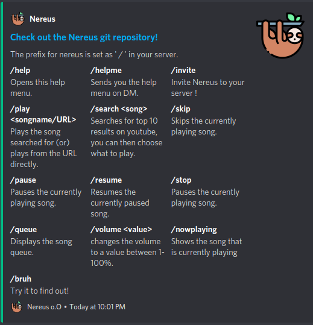

<h1 align="center">Nereus: A Music & LoFi Bot for Discord</h1>

<table>
<tr>
<td>

• A Discord bot written in Discord.js that uses the YouTube API to queue music requested by the user. 
• <b>[Invite](https://discord.com/oauth2/authorize?client_id=734801580548685884&permissions=8&scope=bot)</b> the bot to your own server. 
• Currently used in <b>500+ servers</b> and has been officially <b>[verified](https://support.discord.com/hc/en-us/articles/360040720412-Bot-Verification-and-Data-Whitelisting)</b> by Discord.

</td>
</tr>
</table>

## Support the project by donating here:

## Usage:

- /help for the supported commands.

## Installation:

#### If you want to tweak the code to your needs, follow these steps. If you simply want to use the bot for your own server, [invite](https://discord.com/oauth2/authorize?client_id=734801580548685884&permissions=8&scope=bot) it.

1. Install [ffmpeg](https://ffmpeg.org/download.html).
2. Run `npm -i install` in the project directory.
3. Copy the contents of `.env.example` file into a `.env` file
4. Set the environment variables in the .env file.
5. Run `node .` to start the bot.

## Format for environment variables (.env):

1. Prefix you want for the bot.
2. Token of the bot (from Discord Developer Portal).
3. YouTube API Key from Google Cloud Platform.

## Icon Credits:

Icons made by [Freepik](https://www.flaticon.com/authors/freepik) from [Flaticon.com.](https://www.flaticon.com/)
