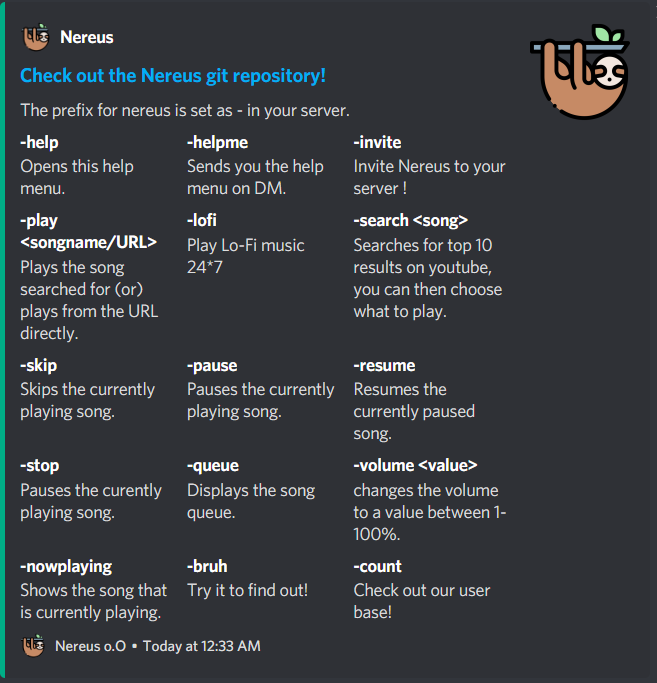

<p align="center"></p>
<h1 align="center">Nereus: A Music & LoFi Bot for Discord</h1>

[](https://github.com/srinathsrinivasan1/Nereus/issues) [](https://github.com/srinathsrinivasan1/Nereus/blob/master/LICENSE) [](https://github.com/srinathsrinivasan1/Nereus/stargazers)

A Discord bot written in Discord.js that uses the YouTube API to queue music requested by the user.

[Invite](https://discord.com/oauth2/authorize?client_id=734801580548685884&permissions=8&scope=bot) the bot to your own server.

## Usage:
* /help for the supported commands.



## Installation:
1. Install [ffmpeg](https://ffmpeg.org/download.html).
2. Run ``` npm -i install ``` in the project directory.
3. Set the environment variables in the .env file.
4. Run ``` node . ``` to start the bot.

## Format for evironment variables (.env):
1. Prefix you want for the bot.
2. Token of the bot (from Discord Developer Portal).
3. YouTube API Key from Google Cloud Platform.

## Icon Credits:

Icons made by [Freepik](https://www.flaticon.com/authors/freepik) from [Flaticon.com.](https://www.flaticon.com/)
